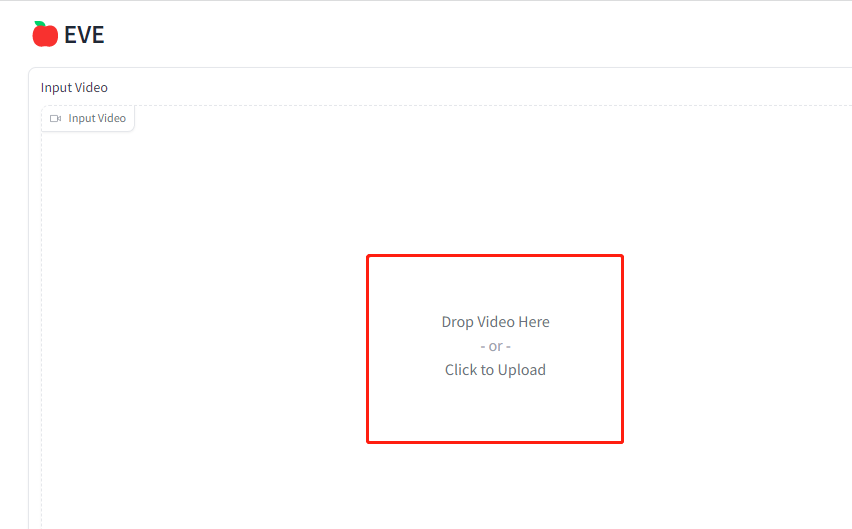
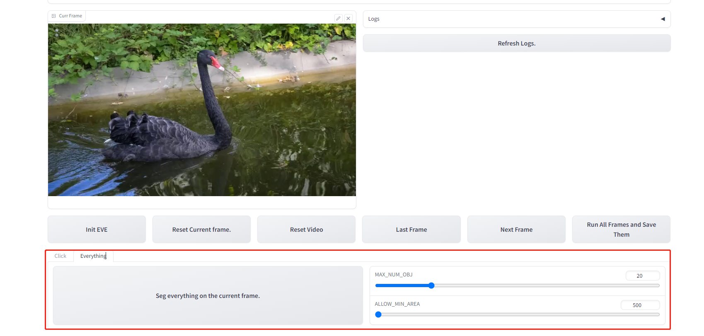
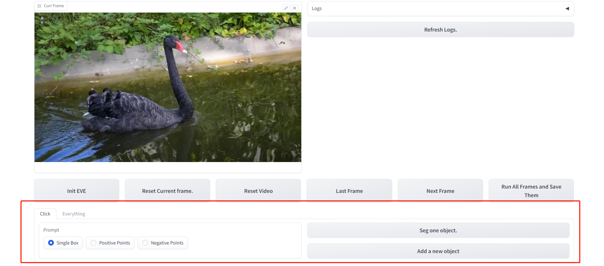
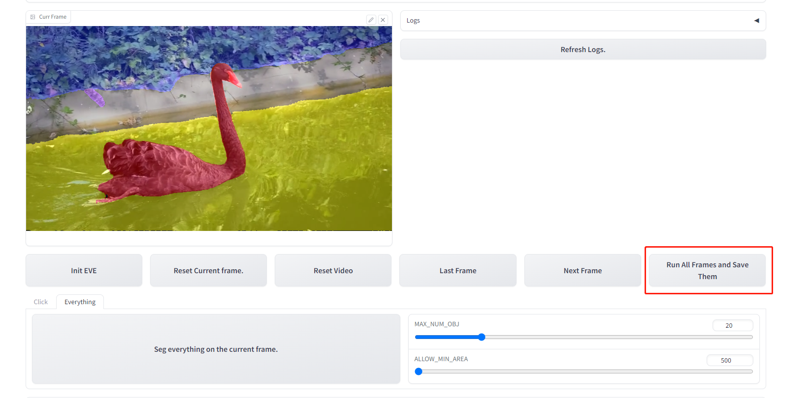

# Detailed Tutorials

* Click `Input Video` button to upload your video. The process of initializing the model and the video can be a bit lengthy, please be patient.

* a) If you want to segment everything in video. First click the `Everything` tab, then drag the slider to select the appropriate 'MAX_NUM_OBJ' and 'ALLOW_MIN_AREA', then click `Segment everything on the current frame`.

* b) If you want segment specific object. First click the `Click` tab, then choose the `prompt` method:

  * `Single Box`:the bounding box of the target.
  * `Positive Points`:Points belonging to the target.
  * `Negative Points`:Points not belonging to the target.

  Then choose segment this target or add a new one.

  * `Segment one object`: Segment the current target. Don't worry if you submit a wrong box or points, you can click this button and submit again. The new mask will replace the old one.
  * `Add a new object`: Save the mask of the current target and use the current points and box to segment a new target.
    
* Click the `Run All frames and Save them` button. You will get the final predictions of the video in the `Output Video` tab. You can also download zips of `Predicted Overlays` and `Predicted Masks`. (NOTE: the preview of `Output Video` may not be available, please download and play it.)

## Other Buttons

`Init EVE`: Initialize the model.

`Reset Current Frame`: Reset the current frame and you can reselect objects.

`Reset Video`: Reset the full video. This button is usually used in conjunction with the `Init EVE`

`Last Frame`: preview the overlay of the last frame.

`Next Frame`: Inference the next frame or preview its overlay.
